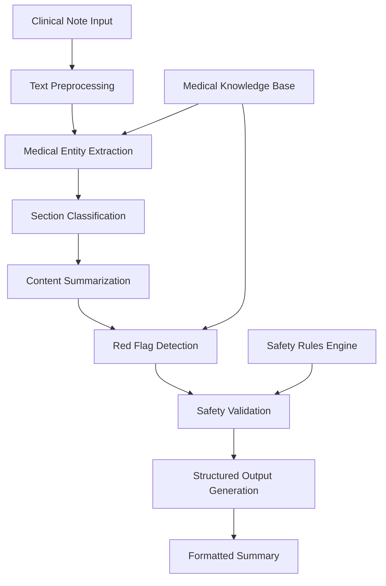

# Design Document: Clinical Summarization Assistant

## Overview

The Clinical Summarization Assistant is an AI-powered system that transforms unstructured clinical notes into structured, concise summaries optimized for clinical handoffs, rounds, and emergency care. The system leverages natural language processing (NLP) techniques to extract, organize, and present clinical information while maintaining strict safety constraints to avoid providing medical advice.

Based on recent research, large language models have demonstrated the ability to outperform medical experts in clinical text summarization tasks across multiple domains including radiology reports, progress notes, and patient dialogue. The system will utilize adapted language models specifically fine-tuned for clinical text processing while implementing robust safety mechanisms to ensure appropriate use.

## Architecture

The system follows a modular pipeline architecture with clear separation of concerns:



### Core Components

1. **Input Processor**: Handles various clinical note formats and performs initial validation
2. **NLP Engine**: Extracts medical entities, relationships, and temporal information
3. **Section Classifier**: Identifies and categorizes clinical information into standard sections
4. **Summarization Engine**: Generates concise summaries while preserving critical information
5. **Red Flag Detector**: Identifies potentially critical findings requiring attention
6. **Safety Validator**: Ensures output contains no diagnostic or treatment recommendations
7. **Output Formatter**: Structures final summaries for clinical consumption

## Components and Interfaces

### Input Processor
```typescript
interface InputProcessor {
  validateInput(clinicalNote: string): ValidationResult;
  preprocessText(rawText: string): ProcessedText;
  extractMetadata(text: string): NoteMetadata;
}

interface ValidationResult {
  isValid: boolean;
  errors: string[];
  warnings: string[];
}

interface ProcessedText {
  cleanedText: string;
  preservedFormatting: FormatElement[];
  detectedSections: SectionHint[];
}
```

### NLP Engine
```typescript
interface NLPEngine {
  extractEntities(text: string): MedicalEntity[];
  identifyRelationships(entities: MedicalEntity[]): Relationship[];
  extractTemporalInfo(text: string): TemporalEvent[];
  resolveAbbreviations(text: string): ResolvedText;
}

interface MedicalEntity {
  text: string;
  type: EntityType;
  confidence: number;
  position: TextSpan;
  normalizedForm?: string;
}

enum EntityType {
  MEDICATION = "medication",
  CONDITION = "condition",
  PROCEDURE = "procedure",
  VITAL_SIGN = "vital_sign",
  ALLERGY = "allergy",
  SYMPTOM = "symptom",
  ANATOMY = "anatomy"
}
```

### Section Classifier
```typescript
interface SectionClassifier {
  classifyContent(text: string, entities: MedicalEntity[]): SectionMapping[];
  identifyMissingSections(mappings: SectionMapping[]): SectionType[];
}

interface SectionMapping {
  sectionType: SectionType;
  content: string;
  confidence: number;
  sourceSpan: TextSpan;
}

enum SectionType {
  CHIEF_COMPLAINT = "chief_complaint",
  HISTORY_PRESENT_ILLNESS = "history_present_illness",
  PAST_MEDICAL_HISTORY = "past_medical_history",
  MEDICATIONS = "medications",
  ALLERGIES = "allergies",
  VITALS = "vitals",
  PENDING_TESTS = "pending_tests"
}
```

### Summarization Engine
```typescript
interface SummarizationEngine {
  summarizeSection(section: SectionMapping): SummarizedSection;
  generateHandoffSummary(sections: SummarizedSection[]): HandoffSummary;
  preserveFactualAccuracy(original: string, summary: string): AccuracyCheck;
}

interface SummarizedSection {
  sectionType: SectionType;
  summary: string;
  keyPoints: string[];
  preservedDetails: CriticalDetail[];
}

interface HandoffSummary {
  briefOverview: string;
  actionItems: string[];
  timelineSummary: string;
  priorityLevel: PriorityLevel;
}
```

### Red Flag Detector
```typescript
interface RedFlagDetector {
  identifyRedFlags(sections: SummarizedSection[]): RedFlag[];
  assessCriticality(flag: RedFlag): CriticalityLevel;
  generateRationale(flag: RedFlag): string;
}

interface RedFlag {
  type: RedFlagType;
  description: string;
  sourceSection: SectionType;
  criticalityLevel: CriticalityLevel;
  rationale: string;
  relatedEntities: MedicalEntity[];
}

enum RedFlagType {
  ABNORMAL_VITALS = "abnormal_vitals",
  SEVERE_ALLERGY = "severe_allergy",
  DRUG_INTERACTION = "drug_interaction",
  URGENT_LANGUAGE = "urgent_language",
  CRITICAL_LAB = "critical_lab"
}
```

### Safety Validator
```typescript
interface SafetyValidator {
  validateOutput(summary: StructuredSummary): SafetyValidation;
  detectMedicalAdvice(text: string): AdviceDetection[];
  sanitizeContent(text: string): string;
}

interface SafetyValidation {
  isCompliant: boolean;
  violations: SafetyViolation[];
  sanitizedContent?: StructuredSummary;
}

interface SafetyViolation {
  type: ViolationType;
  description: string;
  location: TextSpan;
  severity: ViolationSeverity;
}

enum ViolationType {
  DIAGNOSTIC_STATEMENT = "diagnostic_statement",
  TREATMENT_RECOMMENDATION = "treatment_recommendation",
  MEDICATION_DOSAGE = "medication_dosage",
  MEDICAL_ADVICE = "medical_advice"
}
```

## Data Models

### Core Data Structures

```typescript
interface ClinicalNote {
  id: string;
  content: string;
  timestamp: Date;
  author?: string;
  patientId?: string;
  noteType: NoteType;
  metadata: NoteMetadata;
}

interface StructuredSummary {
  id: string;
  sourceNoteId: string;
  generatedAt: Date;
  sections: SummarizedSection[];
  redFlags: RedFlag[];
  handoffSummary: HandoffSummary;
  completenessScore: number;
  safetyValidation: SafetyValidation;
}

interface NoteMetadata {
  facility?: string;
  department?: string;
  encounterType?: string;
  urgencyLevel?: string;
  documentLength: number;
  structuredDataPresent: boolean;
}

enum NoteType {
  ADMISSION = "admission",
  PROGRESS = "progress",
  DISCHARGE = "discharge",
  CONSULTATION = "consultation",
  EMERGENCY = "emergency"
}
```

### Processing Context

```typescript
interface ProcessingContext {
  processingId: string;
  startTime: Date;
  configuration: ProcessingConfig;
  intermediateResults: ProcessingStep[];
  errors: ProcessingError[];
  warnings: ProcessingWarning[];
}

interface ProcessingConfig {
  summaryLength: SummaryLength;
  redFlagSensitivity: SensitivityLevel;
  includeConfidenceScores: boolean;
  preserveOriginalTerminology: boolean;
  targetAudience: AudienceType;
}

enum SummaryLength {
  BRIEF = "brief",
  STANDARD = "standard",
  DETAILED = "detailed"
}

enum AudienceType {
  HANDOFF = "handoff",
  ROUNDS = "rounds",
  EMERGENCY = "emergency"
}
```

## Error Handling

### Error Classification and Response

The system implements a comprehensive error handling strategy that categorizes errors by severity and provides appropriate responses:

**Critical Errors** (System Failure):
- Input validation failures for corrupted or malformed clinical notes
- NLP engine failures that prevent basic text processing
- Safety validation failures that detect potential medical advice generation
- Response: Return error message, log incident, prevent summary generation

**Warning Conditions** (Degraded Functionality):
- Missing sections in clinical notes (e.g., no medication list)
- Low confidence scores in entity extraction or section classification
- Ambiguous medical terminology that cannot be resolved
- Response: Generate summary with warnings, flag uncertain sections

**Information Gaps** (Incomplete Data):
- Absent vital signs, medication lists, or allergy information
- Temporal information that cannot be extracted
- Abbreviations that cannot be resolved
- Response: Note gaps in summary, suggest manual review

### Error Recovery Mechanisms

```typescript
interface ErrorHandler {
  handleCriticalError(error: CriticalError): ErrorResponse;
  handleWarning(warning: ProcessingWarning): WarningResponse;
  handleInformationGap(gap: InformationGap): GapResponse;
}

interface ErrorResponse {
  errorCode: string;
  userMessage: string;
  technicalDetails: string;
  suggestedActions: string[];
  retryable: boolean;
}
```

## Testing Strategy

### Dual Testing Approach

The system requires both unit testing and property-based testing to ensure comprehensive coverage:

**Unit Testing Focus**:
- Specific clinical note formats and edge cases
- Integration between NLP components
- Safety validation with known problematic inputs
- Error handling for malformed or incomplete notes
- Red flag detection for specific clinical scenarios

**Property-Based Testing Focus**:
- Universal properties that must hold across all clinical inputs
- Comprehensive input coverage through randomized clinical note generation
- Validation of safety constraints across diverse medical content
- Consistency properties for summarization accuracy

**Property-Based Testing Configuration**:
- Minimum 100 iterations per property test using a medical NLP testing library
- Each test tagged with: **Feature: clinical-summarization-assistant, Property {number}: {property_text}**
- Custom generators for realistic clinical note content including medical terminology, abbreviations, and structured sections
- Shrinking strategies that preserve medical validity while minimizing test cases

## Correctness Properties

*A property is a characteristic or behavior that should hold true across all valid executions of a system—essentially, a formal statement about what the system should do. Properties serve as the bridge between human-readable specifications and machine-verifiable correctness guarantees.*

### Property 1: Clinical Information Extraction Completeness
*For any* valid clinical note, the Summarization_Engine should extract and preserve all medically relevant entities and relationships without omission, maintaining traceability to the source information.
**Validates: Requirements 1.1, 1.2, 1.4**

### Property 2: Required Section Generation
*For any* clinical note input, the generated summary should contain all required sections (chief complaint, history of present illness, past medical history, medications, allergies, red flags, handoff summary) with appropriate content or explicit notation of absence.
**Validates: Requirements 2.1, 2.2, 2.3, 2.4, 2.5, 2.7, 2.9**

### Property 3: Conditional Section Inclusion
*For any* clinical note containing vital signs or pending tests, the generated summary should include corresponding sections for vitals and pending labs/tests respectively.
**Validates: Requirements 2.6, 2.8**

### Property 4: Safety Constraint Compliance
*For any* generated summary, the output should contain no diagnostic recommendations, treatment prescriptions, or medication dosage advice, limiting content to summarization and structuring of existing information.
**Validates: Requirements 3.1, 3.2, 3.3, 3.5**

### Property 5: Medical Advice Detection and Removal
*For any* summary output that initially contains medical advice language, the safety validation system should detect and remove such content before final output generation.
**Validates: Requirements 3.4**

### Property 6: Information Accuracy Preservation
*For any* clinical note, the generated summary should maintain factual accuracy and consistency with the source information, preserving ambiguity rather than making assumptions when information is unclear.
**Validates: Requirements 4.1, 4.3, 4.4**

### Property 7: Critical Information Inclusion
*For any* clinical note containing critical information, that information should be included in appropriate summary sections and not omitted during the summarization process.
**Validates: Requirements 4.2**

### Property 8: Red Flag Detection and Rationale
*For any* clinical note containing abnormal vitals, severe allergies, medication interactions, or urgent language, the system should flag these as red flags with clear rationale for each designation.
**Validates: Requirements 5.1, 5.2, 5.3, 5.4, 5.5**

### Property 9: Handoff Prioritization
*For any* clinical note processed for handoff, the generated handoff summary should prioritize actionable and time-sensitive information while highlighting pending actions and follow-up requirements.
**Validates: Requirements 6.1, 6.4**

### Property 10: Temporal Information Preservation
*For any* clinical note containing timestamps or multiple notes processed together, the system should preserve temporal relationships and synthesize information chronologically.
**Validates: Requirements 6.2, 7.2**

### Property 11: Mixed Format Processing
*For any* clinical note containing medical abbreviations, structured data mixed with free text, or incomplete sections, the system should process all formats correctly while identifying and flagging missing information.
**Validates: Requirements 7.1, 7.3, 7.4**

### Property 12: Professional Output Formatting
*For any* generated summary, the output should use clear section headers, consistent structure, bullet points for readability, professional medical terminology, and appropriate length for quick review while maintaining completeness.
**Validates: Requirements 8.1, 8.2, 8.3, 8.4**

### Property 13: Rounds Communication Formatting
*For any* summary generated for rounds, the output should be formatted for easy verbal communication during clinical rounds.
**Validates: Requirements 6.3**

### Property 14: Error Handling for Invalid Input
*For any* invalid or corrupted clinical note input, the system should return descriptive error messages rather than attempting to process malformed data.
**Validates: Requirements 1.3**